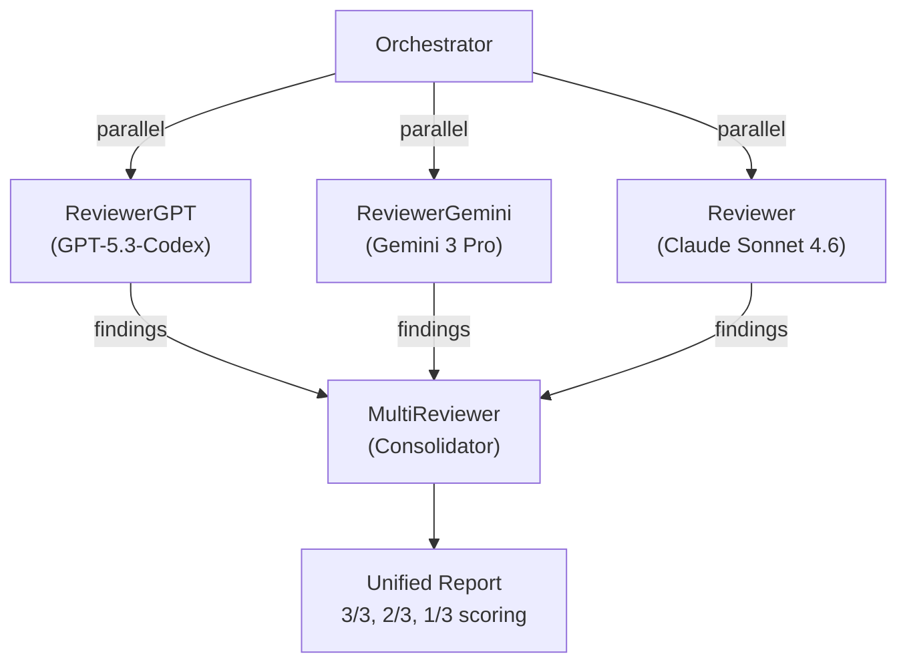
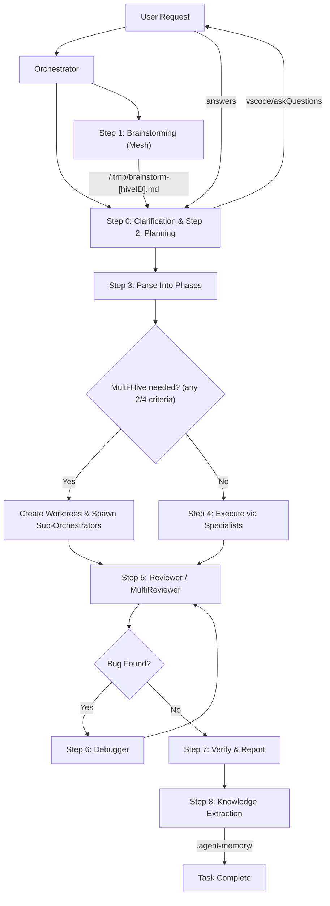

# 🚀 Copilot Agentic Workflow: Hive-Mind Edition

> **This isn't just a workflow. It's a self-evolving AI Hive-Mind.**

This repository contains an opinionated, production-oriented agentic workflow for GitHub Copilot / VS Code Agents, supercharged with **Hive-Mind Intelligence**.

## 🔥 Why this is FIRE

- **🧠 Shared Project Memory**: Agents don't just "forget" after a task. They store architectural decisions and error patterns in `.agent-memory/`, building a long-term "brain" for your project.
- **🕸 Dynamic Mesh Topologies**: For complex design, the Orchestrator doesn't just delegate; it spins up a **Brainstorming Mesh** where specialists collaborate in real-time using the **Hive Protocol (JSON-structured scratchpads)**.
- **⚡️ Neural Pattern Recognition**: The system learns from itself. Reviewers and Debuggers identify recurring patterns. If a bug follows a known pattern, the system triggers a **Refactoring Escalation** to address the root cause, not just the symptom.
- **🎯 Semantic Loading (Triple Search)**: Planners don't just search; they perform a three-level lookup (Grep -> Tactical -> Archive) to ensure every plan is built on the project's full historical context.
- **🛡 Transactional Integrity**: Knowledge preservation is guaranteed. The **Completion Gate** ensures no task is closed until memory entries are verified and committed via a mandatory read-back transaction.
- **🤖 Multi-Hive Coordination**: Scale to massive Epics by spawning nested sub-orchestrators with strict **Hive-ID Isolation** and a **Heartbeat Protocol** for real-time progress monitoring.

---

Based on:

- https://gist.github.com/burkeholland/0e68481f96e94bbb98134fa6efd00436
- https://github.com/simkeyur/vscode-agents
- https://github.com/github/awesome-copilot
- https://github.com/AlexGladkov/claude-code-agents

Inspired by:

- https://github.com/ruvnet/ruflo/wiki/Hive-Mind-Intelligence

## Project Structure

```text
project_root/
├── .agent-memory/
│   ├── project_decisions.md
│   └── error_patterns.md
├── .github/
│   ├── agents/
│   │    ├── orchestrator.agent.md
│   │    ├── planner.agent.md
│   │    └── ...
│   └── skills/
│       ├── api-design/SKILL.md
│       ├── code-quality/SKILL.md
│       └── ...
├── src/
└── ...
```

## Repository Layout

- `.github/agents/orchestrator.agent.md` — top-level workflow controller
- `.github/agents/planner.agent.md` — clarification gate + implementation planning
- `.github/agents/coder-jr.agent.md` — small/safe code tasks
- `.github/agents/coder-sr.agent.md` — moderate/complex code tasks
- `.github/agents/designer.agent.md` — UI/UX and accessibility work
- `.github/agents/reviewer.agent.md` — quality/security/code review gate
- `.github/agents/multi-reviewer.agent.md` — multi-model parallel review with consensus scoring
- `.github/agents/reviewer-gpt.agent.md` — review sub-agent (GPT-5.3-Codex), used by MultiReviewer
- `.github/agents/reviewer-gemini.agent.md` — review sub-agent (Gemini 3 Pro), used by MultiReviewer
- `.github/agents/debugger.agent.md` — reproducible bug diagnosis and fixes
- `.github/skills/*/SKILL.md` — domain playbooks and checklists
- `.github/skills/review-core/SKILL.md` — single shared review contract for all 3 reviewer models

## Agent Contracts

### Orchestrator

- Owns the end-to-end workflow and delegation.
- Must not implement code directly.
- Must start with Planner clarification gate.
- Must build phased execution from file overlap/dependencies.
- Must run Reviewer (or MultiReviewer for complex changes) before completion.
- Must invoke Debugger only for concrete reproducible failures.

### Planner

- Dual role: clarification gate (Phase A) and planning (Phase B).
- Must not produce a plan until clarification is complete.
- **Triple Search**: Must perform semantic loading (Grep, Filename, Archive) before planning.
- Uses `vscode/askQuestions` to natively prompt the user for clarification without interrupting the run.
- Must provide step-by-step plan with **Memory Citations**, affected files, dependencies, and risks.
- Must not write code.

### CoderJr

- Handles straightforward tasks: small fixes, simple features, minor updates, basic tests.
- Must keep changes minimal and follow existing patterns.
- Should be first coding choice for low-complexity tasks.

### CoderSr

- Handles moderate/complex tasks, architecture-sensitive work, security/performance-critical work.
- Receives escalations from CoderJr and must continue from current state (no restart).
- Enforces stronger architectural and quality discipline.

### Designer

- Handles UI/UX, accessibility, visual hierarchy, and presentation-layer improvements.
- Must not change business logic or system behavior outside UI scope.
- Must report assumptions and accessibility notes in final output.

### Reviewer

- Performs bug/security/performance/quality review before completion.
- Must prioritize findings by severity and provide actionable, file-specific feedback.
- Must not implement fixes directly.

### Debugger

- Activated only for confirmed reproducible failures.
- Must follow reproduce -> root cause -> minimal fix -> verification flow.
- Returns control to Orchestrator/Reviewer after fix verification.

### MultiReviewer

- Runs the same review against GPT-5.3-Codex, Gemini 3 Pro, and Claude Sonnet 4.6 in parallel.
- Consolidates findings with consensus scoring (3/3, 2/3, 1/3).
- Used for complex, security-sensitive, or architecture-critical changes.
- Orchestrator decides when to use MultiReviewer vs. standard Reviewer.
- Sub-agents (ReviewerGPT, ReviewerGemini) are never called directly by the user; they are invoked only as inputs to the MultiReviewer flow.



## Current Agent Workflow

1. **Step 0: Clarification Gate** — Orchestrator starts with Planner and proceeds only when Planner returns `Clarification Status: COMPLETE`.
2. **Step 1: Brainstorming (Mesh)** — Optional mode enabled by an explicit trigger (`any 2/4` criteria), bounded by `max_rounds=3`; specialists collaborate via **Hive Protocol (JSON)** in `/.tmp/brainstorm-[hiveID].md`.
3. **Step 2: Get the Plan** — Planner provides a strategy backed by **Triple Search** memory consultation.
4. **Step 3: Parse Into Phases** — Orchestrator splits the plan into phases or sub-hives.
5. **Step 4: Execute Each Phase** — Specialists implement, monitored by sub-hive **Heartbeats**.
6. **Step 5: Review Before Finalizing** — Code is reviewed by `Reviewer` (single mode) or by `MultiReviewer` flow (three parallel reviewers + consolidation).
7. **Step 6: Debug & Refactor Loop** — `Debugger` fixes bugs. If a pattern is recurring, triggers **Refactoring Escalation** back to Step 0.
8. **Step 7: Verify and Report** — Final verification of the integrated result.
9. **Step 8: Transactional Knowledge Extraction** — Lessons are saved to `.agent-memory/` with a **Completion Gate** for verification; approved skill updates are delegated and persisted consistently.

## Mermaid Diagram



## Escalation Rules

- Start coding with `CoderJr` for simple tasks.
- Escalate to `CoderSr` when:
  - progress stalls,
  - complexity/security/performance scope increases,
  - broader architectural changes are required.
- During escalation, Orchestrator must pass:
  - original task,
  - Planner plan,
  - completed/partial `CoderJr` results,
  - triggering review/debug feedback.

## Parallelization and Conflict Rules

- Run tasks in parallel only when files do not overlap and there are no data dependencies.
- Run tasks sequentially when file overlap or dependency exists.
- Orchestrator must assign explicit file ownership in delegation prompts.
- When parallel tasks MUST modify overlapping files as independent features, use git worktree (see below).

## Git Worktree & Multi-Hive Strategy

- Worktrees are used **conditionally** — only when standard file-ownership parallelization is insufficient.
- **Multi-Hive Coordination**: Large Epics are split into independent worktrees, each managed by a **Sub-Orchestrator** (e.g., separate Frontend and Backend hives).
- **Priority Rule**: If Multi-Hive trigger (`any 2/4`) is satisfied, Multi-Hive worktree usage takes precedence; the stricter non-Multi-Hive worktree rule is for regular parallel execution.
- Orchestrator owns worktree lifecycle: create → delegate → merge → cleanup.
- Agents work within worktrees but NEVER create or remove worktrees; only the main Orchestrator can perform worktree create/merge/cleanup.
- See `.github/skills/git-worktree/SKILL.md` for detailed guidance.

### Official Multi-Hive Trigger (any 2 apply)

1. **Structural Split**: `>=2` independent subsystems (e.g., `/frontend` + `/backend`, `ios` + `android`).
2. **Conflict Risk**: high overlap risk in shared files (e.g., `build.gradle`, `shared/commonMain`).
3. **Task Volume**: expected scope is `>5` phases or `>15` independent subtasks.
4. **Environment Isolation**: risky refactor or long debugger isolation needed.

## Review and Debug Control

- Orchestrator is the controller of review/debug loop.
- Reviewer and Debugger provide findings/results; Orchestrator decides next action and completion.
- Completion should be reported only after:
  - review issues are resolved or accepted,
  - reproducible failures are debugged and re-reviewed.

## Hard Boundaries

- Orchestrator: no direct implementation.
- Planner/Reviewer: no code writing.
- Debugger: no speculative fixes without reproduction.
- Designer: no business-logic or backend/data-flow changes.
- Coders: follow repository patterns and delegated scope.

## Skills & Neural Pattern Recognition

- **Dynamic Injection**: Orchestrator analyzes tasks and dynamically injects relevant `@skills/` (e.g., `.github/skills/android/SKILL.md`) into the agent's prompt with prioritized hierarchy.
- **Neural Pattern Recognition**: Reviewer and Debugger identify new patterns or anti-patterns and propose updates to skill files.
- **Self-Learning**: Orchestrator delegates the persistent update of `.github/skills/*.md` files to **CoderJr** based on these proposals.
- Current skill domains:
  - API design and integration
  - Code quality and clean code
  - Data transformation and ETL
  - Database optimization
  - Frontend architecture and performance
  - Git worktree (conditional parallel execution)
  - Multi-model review (consensus-based code review)
  - Security best practices
  - Testing and QA
  - Full-stack patterns (TypeScript, Kotlin, Swift)
  - Mobile architecture (Android/Compose, iOS/SwiftUI)

## Design Principles

- Clear ownership and strict role boundaries.
- Parallel execution only for non-overlapping files.
- Escalation from `CoderJr` to `CoderSr` when complexity increases.
- No hidden implementation by orchestrator; delegation only.

## Notes

- Skill files are reference material for implementation quality.
- Keep agent instructions synchronized when introducing new roles or step rules.

## License

Please see the original gist for license and attribution details; this repo preserves the original orchestrator file for reference.
